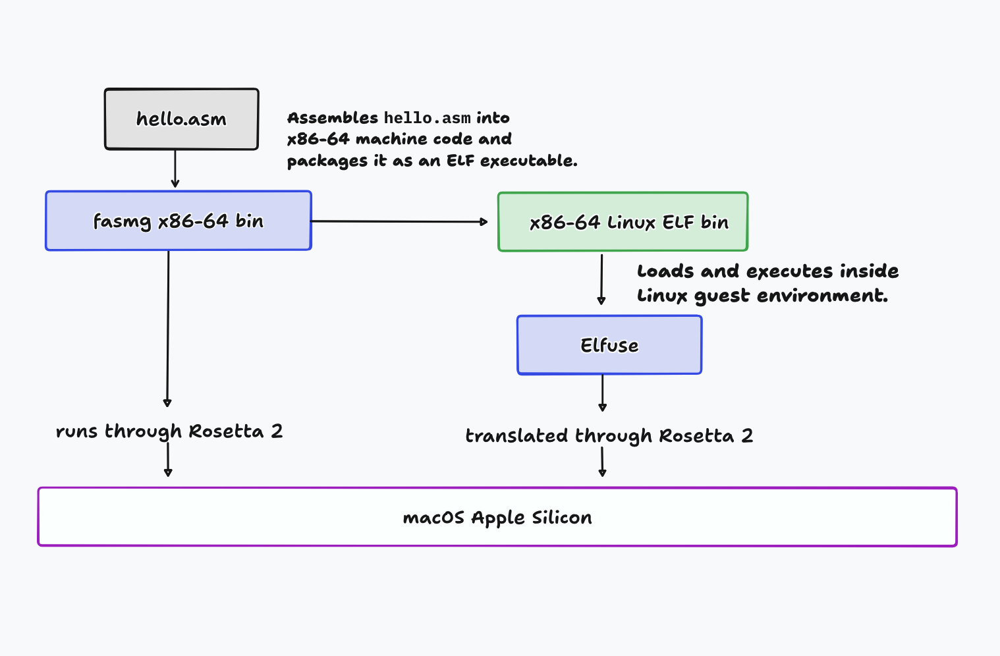

# x86-linux-asm

 A small, portable x86-64 Linux assembly environment for macOS Apple Silicon.

 The repository includes:

- `fasmg` — assembler
- `elfuse` — runs x86-64 Linux ELF binaries on Apple Silicon macOS
- FASM/fasmg x86 include files
- Official fasmg documentation
- A simple `Makefile` for building and running programs

## Architecture


 ## Requirements

- Apple Silicon Mac
- macOS with Rosetta available
- `make`
- `greadelf` for optional ELF inspection
Got it — keep your wording exactly as-is and just frame the section as **official `elfuse` limitations**.

## Limitations

 The following limitations apply to `elfuse`, as described by the official `elfuse` repository:

 `elfuse` runs single Linux user-space processes (and their fork / exec children). It is not a Linux kernel. That framing shapes both what it does and what it explicitly will not do.

 Linux kernel features that have no user-space-syscall analog: namespaces, cgroups, kernel modules, eBPF, io\_uring, KVM, perf events.\
 Intel Macs. Apple Silicon only (M1 and later).\
 Hosting a VM from inside a guest. The guest cannot use HVF or KVM.\
 One guest process tree per elfuse host process. HVF allows one VM per host process; Linux-style fork is implemented by posix\_spawn-ing a fresh elfuse host process and transferring state (see docs/internals.md).\
 Up to 64 concurrent guest threads per VM (MAX\_THREADS = 64).\
 The implemented syscall set is src/syscall/dispatch.tbl; anything outside it returns -ENOSYS rather than silently succeeding.\
 FUTEX\_LOCK\_PI and friends behave as plain mutex acquire / release; true priority-inheritance scheduling is not modeled.\
 sched\_setaffinity is honored as a no-op (returns the all-CPUs mask); the host scheduler picks the actual CPU.\
 /proc, /dev, and mount data are synthetic compatibility views, not host pass-throughs.\
 uname and /proc/version report Linux 6.18 LTS, a floor for version-gated userspace; src/syscall/dispatch.tbl states what is implemented.

## Build

```
make
```

 The ELF executable is produced in:

```
build/hello
```

 ## Run

```
make run
```

 Example:

```
Hello from x86-64!
```

 ## Inspect the ELF

```
make check
```

 Or directly:

```
greadelf -h build/hello
greadelf -lW build/hello
```

 ## Clean

```
make clean
```

 ## Portability

 The repository is self-contained: `fasmg`, `elfuse`, and the required include files live inside the repository.

 No global `PATH` or `INCLUDE` configuration is required.
 
 ### Included tools

 - **fasmg** — Flat Assembler Macro-Assembler\
   Version: `g.l8vn`\
   Source: official [fasmg](<https://flatassembler.net/docs.php?article=fasmg>) distribution
- **elfuse** — x86-64 Linux ELF runner for Apple Silicon macOS\
   Source: [sysprog21/elfuse](<https://github.com/sysprog21/elfuse>)

 The bundled binaries are the versions tested with this repository.

 Clone the repository and run:

```
make
make run
```

 > This setup targets Apple Silicon macOS and x86-64 Linux ELF binaries.
